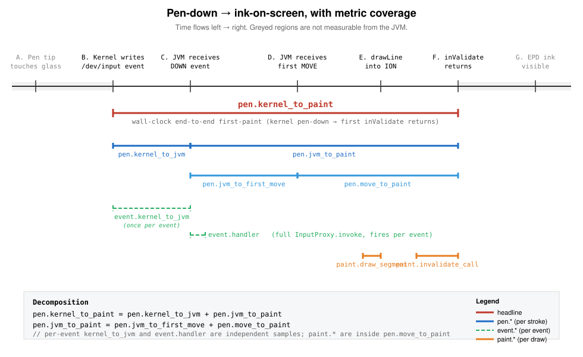

# inksdk perf counters

The library records latency at every stage of the pen-down → ink-on-screen
pipeline so we can isolate where time goes. All counters live in
`com.inksdk.ink.PerfCounters` and are recorded on the binder thread with no
allocations on the hot path.



The diagram above ([source](metrics-timeline.svg)) maps which event
boundaries each metric spans.

## Where the time actually goes

The full journey from pen tip touching glass to ink visible on the EPD has
seven measurable stages:

| | Stage | What happens |
|---|---|---|
| **A** | Pen tip on glass | Hardware contact. Not measurable from software. |
| **B** | Kernel input event | Touch IC samples, kernel writes `/dev/input` event. The xrz daemon reads this almost immediately and timestamps it (CLOCK_REALTIME, exposed via the binder callback's `args[5]`). We treat this daemon-read time as a stand-in for B. |
| **C** | JVM receives DOWN | The daemon dispatches the binder call; our `InputProxy.invoke` runs on a binder thread. |
| **D** | JVM receives first MOVE | The first `ACTION_MOVE` after `ACTION_DOWN`. This is the first event with anything paintable, since a line needs two points. |
| **E** | `drawLine` returns | We've painted the first segment into the daemon's ION-backed Canvas. |
| **F** | `inValidate` returns | We've told the daemon to push the dirty rect to the EPD. The daemon owns whatever happens after this. |
| **G** | EPD pixels visible | Daemon's waveform completes on the panel. Not measurable from the JVM — only a high-speed camera can capture it. The Bigme HiBreak Plus's `MODE_HANDWRITE` waveform takes ~30–40 ms. |

`A → B` and `F → G` are dark zones — counter values do not include them.
The library captures the entire `B → F` span: everything we can influence in
software.

## Counters

Three tiers, named by sample rate:

- **`pen.*`** — one sample per stroke. Captures the pen-down-to-paint
  experience. These are the latencies a user actually perceives.
- **`event.*`** — one sample per binder event. Captures dispatch and
  per-event JVM-side overhead.
- **`paint.*`** — one sample per draw segment (per `ACTION_MOVE`). Captures
  the actual draw + invalidate calls.

### `pen.*` (one sample per stroke)

| Name | Span (see SVG) | Definition |
|---|---|---|
| `pen.kernel_to_paint` | B → F | **Headline metric.** Wall-clock from kernel pen-down to first `inValidate` returning. The most direct answer to "how long until ink shows." |
| `pen.kernel_to_jvm` | B → C | Wall-clock from kernel pen-down to the DOWN event landing in `InputProxy.invoke`. Measures kernel + daemon + binder dispatch for the DOWN event only. |
| `pen.jvm_to_paint` | C → F | JVM-monotonic from DOWN landing in JVM to first `inValidate` returning. The pure software cost once the event is in the JVM. |
| `pen.jvm_to_first_move` | C → D | JVM-monotonic from DOWN to the first MOVE arriving. Includes (a) kernel + binder dispatch of the MOVE and (b) the user's actual pen-movement speed. **Do not interpret this as pure stack overhead** — a slow scribbler inflates the tail. |
| `pen.move_to_paint` | D → F | First MOVE landing in JVM → first `inValidate` returns. Pure JVM-side processing with no user-input contamination. The cleanest measure of "how fast can we render once we have something to render." |

Decomposition:

```
pen.kernel_to_paint  =  pen.kernel_to_jvm  +  pen.jvm_to_paint
pen.jvm_to_paint     =  pen.jvm_to_first_move  +  pen.move_to_paint
```

### `event.*` (one sample per binder event)

| Name | Definition |
|---|---|
| `event.kernel_to_jvm` | Wall-clock from the daemon's CLOCK_REALTIME timestamp to our `InputProxy.invoke` entry. Same as `pen.kernel_to_jvm` but recorded for **every** event, not just DOWN. Useful for spotting binder-thread starvation under sustained load. |
| `event.handler` | Full `InputProxy.invoke` wall time. Captures everything we do for one event: drawLine (on MOVE), inValidate (on first/throttled MOVEs and UP), accumulator updates, perf recording. |

### `paint.*` (one sample per draw segment)

| Name | Definition |
|---|---|
| `paint.draw_segment` | Wall time of one `Canvas.drawLine` into the daemon's ION buffer. |
| `paint.invalidate_call` | Wall time of one `client.inValidate(rect, mode)` binder round-trip. |

## How to read a snapshot

Each counter exposes `count`, `lastMs`, `p50Ms`, `p95Ms`, `maxMs`, and the
last `samples` list. Hosts call:

```kotlin
val s = PerfCounters.get(PerfMetric.PEN_KERNEL_TO_PAINT)
Log.i(TAG, "first-paint p50=${s.p50Ms}ms p95=${s.p95Ms}ms max=${s.maxMs}ms")
```

or dump everything:

```kotlin
for ((m, snap) in PerfCounters.snapshot()) {
    if (snap.count == 0L) continue
    Log.i(TAG, "${m.label}: count=${snap.count} p50=${snap.p50Ms}ms p95=${snap.p95Ms}ms max=${snap.maxMs}ms")
}
```

## Diagnostic playbook

When `pen.kernel_to_paint` p95 is high, the breakdown tells you where to
look:

| Symptom | Likely cause |
|---|---|
| `pen.kernel_to_jvm` high | Kernel/daemon/binder dispatch slow — usually binder thread contention from concurrent IPC, GC pauses, or CPU throttling. The daemon side is fine; *something* is delaying its callback into our JVM. |
| `pen.jvm_to_first_move` high (but `pen.move_to_paint` is fine) | Either MOVE-event dispatch is slow (same root causes as above) or the user just moves slowly. Cross-check with `event.kernel_to_jvm` — if that's also high, it's dispatch; if it's low, it's the human. |
| `pen.move_to_paint` high | Our drawLine + inValidate path is slow. Check `paint.draw_segment` vs `paint.invalidate_call` to localize. |
| `paint.invalidate_call` p95 high | Daemon is slow to ack the binder call. Could be panel waveform contention, daemon GC, or a stuck refresh queue. |
| All `pen.*` healthy but ink visibly lags | Stage F → G (EPD waveform). The daemon has accepted the request; the panel itself is slow to flip pixels. Not addressable from this library. |

## Custom prefix

`PerfCounters.prefix` defaults to `"ink."`. Hosts that want to merge our
counters into their own perf system can override it once at startup:

```kotlin
PerfCounters.prefix = "myapp.ink."
```

This affects `PerfMetric.label` for every metric (e.g.
`pen.kernel_to_paint` → `myapp.ink.pen.kernel_to_paint`).

## Touch-IC wake — the irreducible cold first-stroke cost

On the Bigme HiBreak Plus (Android 14, daemon v1.4.0) the very first stroke
after a cold app launch — or after a long idle period with no stylus
proximity — costs **100–170 ms** even though every JVM-side metric
(`pen.jvm_to_paint`, `pen.move_to_paint`, `event.handler`, etc.) measures
1–5 ms. The cost shows up in `pen.kernel_to_jvm`: kernel pen-down
timestamp → daemon-binder → JVM `InputProxy.invoke` entry. Subsequent
strokes pay 3–8 ms in this metric; only the first one pays 100+.

**Cause** (verified empirically with the slim demo):

- The touch IC drops into a low-sample-rate sleep state when nothing is
  near the screen. Physical capacitive proximity (a stylus hovering 1–2 cm
  above the panel) wakes it.
- The xrz `handwrittenservice` daemon **does not** dispatch hover /
  `ACTION_NEAR` events to the registered `InputListener` under any
  configuration we tried — neither the cooked path (with internal
  `convertXY`) nor the raw path (`setUseRawInputEvent(true)`).
- Therefore `inValidate(MODE_HANDWRITE)` on a 1×1 rect, `setOverlayEnabled`
  toggles, and any other JVM-driven daemon call **cannot warm the touch
  IC**. They reach the EPD waveform engine, which is the wrong subsystem.

**Implications:**

- Real users almost always hover before touching, so the IC is warm by the
  time the pen actually contacts the screen. The cold case occurs only
  when the pen is already in contact at app launch, or after a long idle
  with the pen put down elsewhere.
- The library exposes no `prewarm()` API. The historic `ACTION_NEAR`
  pre-warm pattern from xNote / Mokke is dead code on this firmware.
- For dashboards, the cold first stroke shows up as a single outlier in
  `pen.kernel_to_paint`'s `max` while `p50`/`p95` stay tight. That
  outlier is expected and not actionable.

If a future firmware does start dispatching `NEAR` to InputListener, the
controller would record a sample in `event.kernel_to_jvm` for it — that's
the signal to add a pre-warm path back.

## What we deliberately do *not* measure

- **A → B** (pen tip → kernel event). Requires kernel ftrace; out of scope.
- **F → G** (inValidate return → pixels visible). Requires hardware
  instrumentation. Track separately if perceived vs measured latency drift.
- **Multi-stroke regression**. Counters are global ring buffers across all
  strokes. If you want per-stroke debugging, capture `samples` immediately
  after the stroke and pair them with your stroke ID host-side.

## Per-controller coverage

Not every metric is recordable on every controller — some metrics need a
JVM-side moment that a vendor SDK doesn't expose.

| Metric | Bigme | Onyx | Reason for Onyx gap |
|---|---|---|---|
| `pen.kernel_to_paint` | ✅ | ❌ | TouchHelper paints in native code; no JVM-observable "first paint issued" moment. |
| `pen.kernel_to_jvm` | ✅ | ✅ *(planned)* | `TouchPoint.timestamp` (uptimeMillis) gives the equivalent of the daemon's CLOCK_REALTIME. |
| `pen.jvm_to_paint` | ✅ | ❌ | Same as `pen.kernel_to_paint`: no JVM "paint issued" boundary on Onyx. |
| `pen.jvm_to_first_move` | ✅ | ✅ *(planned)* | `onBeginRawDrawing` → first `onRawDrawingTouchPointMoveReceived`. |
| `pen.move_to_paint` | ✅ | ❌ | No paint boundary. |
| `event.kernel_to_jvm` | ✅ | ✅ *(planned)* | Per-callback dispatch latency from `tp.timestamp`. |
| `event.handler` | ✅ | ✅ *(planned)* | Wall time of each `RawInputCallback` body. |
| `paint.draw_segment` | ✅ | ❌ | We don't issue draw calls under Onyx. |
| `paint.invalidate_call` | ✅ | ❌ | We don't issue invalidates under Onyx. |

"*(planned)*" entries are not yet wired in `OnyxInkController`; they will
populate the same enum entries when wired (no schema change). All
percentile snapshots silently report `count=0` for unrecorded metrics.
